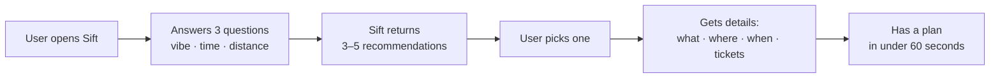
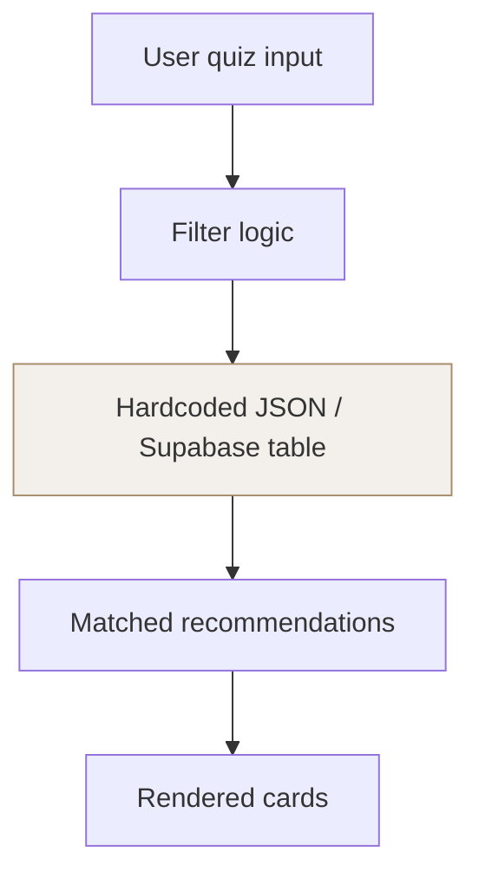

# Sift

## What This Is
- See `docs/ongoing/BRIEF.md`
- NYC event discovery app for young professionals (22–30). Ask 3 questions, get 3–5 things worth doing this weekend. Replaces the 6-app spiral with one fast answer.

## Tech Stack
- See `docs/ongoing/ARCHITECTURE.md`
- **Frontend:** Next.js (App Router) + TypeScript
- **Backend / DB:** Supabase (auth, database, storage)
- **Hosting:** Vercel
- **Mobile (future):** React Native + Expo — same Supabase backend
- **Events data:** Hardcoded JSON → Supabase table (MVP). Live scraping / API integrations come after core flow is validated.

## Project Structure
- `src/` or `app/` — application code
- `tests/` — test files mirror source structure
- `docs/ongoing/` — living docs (product brief, brand position, style guide, architecture)
- `docs/features/` — feature briefs, architectures, plans

## Onboarding Docs (`docs/ongoing/`)
Always read these at the start of a session before writing any code or copy.

- `PRODUCT_BRIEF.md` — problem, target user, value prop, key features
- `BRAND_POSITION.md` — positioning, canonical language, language to avoid, user archetypes
- `STYLE_GUIDE.md` — color palette (hex codes), typography (Merriweather + Inter), component patterns, spacing tokens
- `ARCHITECTURE.md` — system overview, data models, API design (update during build)

These are living documents. Update them as the product evolves.

## Core User Flow

## Data Flow (MVP)

## What's Faked (WoZ)
- **Event data is hardcoded** — not live scraped. A curated set of NYC events across 4–6 categories (arts, comedy, music, food, outdoors, nightlife) lives in a static dataset.
- Filtering logic is real. Only the data source is manual.
- Events are updated by hand until the core flow is validated.
- **Un-faking plan:** Eventbrite API → NYC Open Data → venue partnerships, once we have signal on which categories matter most.

## Documentation Style
Use Mermaid diagrams for flows, sequences, state machines, data relationships, and decision trees. A Mermaid diagram is almost always better than a bulleted list of steps. Use them as often as reasonable. **Never write ASCII diagrams.**

## Code Conventions
- **Language:** TypeScript throughout
- **Components:** Functional components with hooks — no class components
- **Naming:** camelCase for variables/functions, PascalCase for components
- **API pattern:** RESTful, JSON responses
- **Error format:** `{ error: string, details?: object }`
- **Styles:** Follow `STYLE_GUIDE.md` exactly — use brand tokens (colors, type scale, spacing) rather than hardcoded values

## Brand Rules (enforce in all UI code)
- Body text and headings: `#293132` (Dark Teal) — never pure `#000000`
- Primary action color: `#547AA5` (Steel Blue) — buttons, links, CTAs
- Warm accent: `#A68B6B` (Warm Stone) — urgency tags, "ending soon", category badges. Use sparingly.
- Canvas: `#EFEFF0` (Off-White)
- Heading font: Merriweather (serif). Body font: Inter (sans-serif).
- See `STYLE_GUIDE.md` for full component patterns, spacing tokens, and motion rules.

## Git Workflow
- `main` is protected. Never push directly.
- Feature branches: `feature/short-description`
- PRs require one reviewer before merge.
- Commit messages: imperative tense (`Add quiz flow`, not `Added quiz flow`)

## Testing
- Write tests for new features before or alongside code
- Tests live in `tests/` mirroring source structure
- Run: `npm test`

## Environment
- See `docs/ongoing/ARCHITECTURE.md`
- Supabase project URL and anon key go in `.env.local` — never commit secrets

## Known Issues / Gotchas
- Event data is manually maintained for MVP — coordinate with the team before editing the source dataset
- Lovable landing page lives separately at `sift-landing-page.lovable.app` — not part of this repo
- Reddit organic strategy requires zero product mentions for the first 2 weeks — see `demand_gen_strategy.md`

## Team
- **Jerry** — Build (frontend + product)
- **Yijie** — Build (frontend + product)
- **Irene** — Demand gen (community, social)
- **Jary** — Demand gen (email, referrals)

> All four work across both build and demand gen. Roles reflect primary ownership, not strict boundaries.
