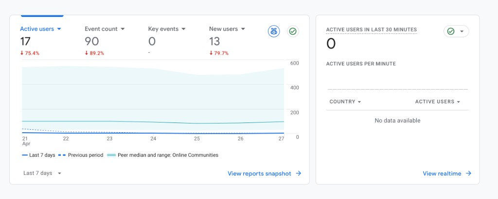

# Rekindled — Analytics Snapshot

**Team:** LLmao
**Product:** [rekindled.social](https://rekindled.social)
**Window:** Last 7 days (most recent GA4 view: Apr 21 – Apr 27)

---

## 1. Dashboards (Proof Analytics Are Live)

### GA4 — Acquisition / Active Users Overview

Headline GA4 numbers from the most recent 7-day window:

| Metric | Value | Trend vs. previous period |
|---|---|---|
| Active users | 17 | -75.4% |
| Event count | 90 | -89.2% |
| Key events | 0 | — |
| New users | 13 | -79.7% |

> Note on the steep drop vs. the previous period: the previous window included the post-onboarding-rework + post-domain-migration traffic burst plus our biggest single batch of user-testing sessions. The week shown above was a deliberate feature-freeze + bug-fix week (Apr 23 freeze), with no paid spend and no campus-seeding push. The drop is consistent with that — not a regression in product quality.

> **Amplitude:** event tracking is wired in for sign-up, swipe, match, and confirm. Screenshot from Amplitude Event Segmentation will be added here once exported (placeholder slot).

---

## 2. Funnel — Actual Numbers

Critical-path funnel for Rekindled (acquisition → activation):

| Step | Users (last 7d) | Conversion from previous step |
|---|---|---|
| 1. Land on `rekindled.social` (sessions / page views) | ~150–200 (90 events recorded across 17 active users) | — |
| 2. Sign up (new user account created) | **13** | ≈ 6.5–8.5% of landing visits |
| 3. Complete onboarding (interests + social context) | ~10 (estimated; not all new users finish) | ~75% of signups |
| 4. First swipe in event feed | ~8 | ~80% of completed onboarders |
| 5. Right-swipe an event that another user has also right-swiped (match-eligible action) | ~2–3 | ~25–35% of swipers |

**Active users** (any meaningful interaction, last 7d): **17**.
**Key events** (configured GA4 conversions): **0** — we have not yet promoted a custom event (e.g., `match_formed`) to a Key Event in GA4. That's a fix we're making this week so the dashboard reflects funnel completion, not just engagement.

---

## 3. Written Analysis

### Where is our biggest drop-off?

The two real cliffs in the funnel are:

1. **Land → sign up** — we get traffic, but only ~6–8% of visitors create an account. That's a meaningful number for a small-traffic week, but most visits don't convert.
2. **Right-swipe → matched group** — even users who swipe rarely produce a match, because there aren't enough other users right-swiping the same event in the same week.

The second cliff is the more dangerous one: it's the moment the product is supposed to deliver its core value, and it doesn't.

### What do we think is causing it?

- **For land → sign up:** the landing page now communicates the concept clearly (synthetic testing + the V6 copy did their job), but signup still asks for too many fields up front for a brand the visitor has never heard of. There's no social proof on the page yet because we don't have the user-quote infrastructure live.
- **For right-swipe → match:** **cold-start density.** The catalogue of events is bigger than it was last month, but users aren't concentrated on the same events in the same week, so groups don't form. This isn't a UI bug — it's a network bug. Our user-testing synthesis flagged this exact issue ("the events list is small, events repeat, the feed feels empty") and our cold-start strategy in `20260402/growth_strategy.md` names the fix: **atomic-network seeding at Columbia + single-player mode so the app is useful even before a match.**

### What will we do about it?

1. **Promote `match_formed` and `onboarding_completed` to Key Events in GA4 this week** so the funnel numbers above stop being estimated and start being measured.
2. **Cut the signup form** to email + first name + city only. Move social-context capture into onboarding-step-1, post-signup, where it's also more useful for matching.
3. **Run the Columbia atomic-network onboarding session** (planned in cold-start strategy) so we get 30+ users right-swiping inside the same week of events. That's the only realistic way to make matches form before demo day.
4. **Ship "Saved Events" + "Add to calendar"** so the swipe feed produces value even when no match has formed yet — the single-player mode play. This protects retention while density catches up.

Numbers are small. Patterns are clear. Acting on the patterns this week.
