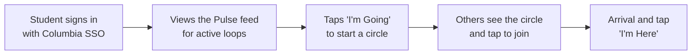
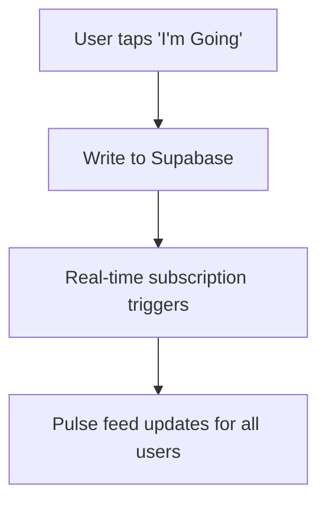

# Circles

## What This Is
- See `docs/ongoing/PRODUCT_BRIEF.md`
- A proximity and intent platform for Columbia & Barnard students. It reduces the social friction of the invite by transitioning social life from static directories and stressful group chats into a live heatmap of current activities and mutual interests. 

## Tech Stack
- See `docs/ongoing/ARCHITECTURE.md`
- **Frontend:** React + Vite + TypeScript (Mobile-First SPA, no SSR)
- **Styling:** Custom CSS / Tailwind CSS
- **Backend / DB:** Supabase (for real-time database subscriptions)
- **Authentication:** Supabase Auth (Strict `.columbia.edu` or `.barnard.edu` SSO)

## Project Structure
- `src/` — application code (`src/pages/`, `src/components/`, `src/layouts/`)
- `tests/` — test files mirror source structure
- `docs/ongoing/` — living docs (product brief, brand position, style guide, architecture)
- `docs/features/` — feature briefs, architectures, plans

## Onboarding Docs (`docs/ongoing/`)
Always read these at the start of a session before writing any code or copy.

- `PRODUCT_BRIEF.md` — problem, target user, value prop
- `BRAND_POSITION.md` — positioning, brand voice
- `STYLE_GUIDE.md` — visual tone, color palette (Columbia Blue `#B9D9EB`), component patterns
- `ARCHITECTURE.md` — system overview, data models, API design (add during build)
- `mvp_doc.md` — scope, core flows, faked features, demand gen strategy

These are living documents. Update them as the product evolves. Every `.tsx` file must also have a companion `.md` file.

## Core User Flow

## Data Flow (MVP)

## What's Faked (WoZ)
- **Shadow Circles:** To combat the "Empty Table" problem, the team manually seeds activities daily (e.g., "Coffee Runs") for the first 500 users. Organic user-generated circles will eventually sustain the density.

## Documentation Style
Use Mermaid diagrams for flows, sequences, state machines, data relationships, and decision trees. Diagrams are faster to read and more precise than prose. A Mermaid diagram is almost always better than a bulleted list of steps. Use Mermaid diagrams as often as is reasonable. NEVER write ASCII diagrams.

## Code Conventions
- **Naming:** camelCase for JS/TS, PascalCase for components
- **Component pattern:** functional components with hooks
- **API pattern:** RESTful, JSON responses
- **Error format:** `{ error: string, details?: object }`
- **Styling/UX:** TailwindCSS with a Mobile-First approach. Ensure all interactive elements have a **minimum touch target of 44x44px**. 

## Brand Rules (enforce in all UI code)
- **Primary (Columbia Blue):** `#B9D9EB` — buttons, key CTAs, active states
- **Secondary (Deep Blue):** `#1D4F91` — hover states, emphasis text, contrast-heavy elements
- **Background:** `#F5F7FA` or `#FFFFFF` (white interior surfaces)
- **Text:** `#111827` (never pure black)
- **Fonts:** Space Grotesk (Headings), Inter / System Sans-serif (Body)

## Git Workflow
- `main` is protected. Never push directly.
- Create feature branches: `feature/short-description`
- PRs require one reviewer before merge.
- Commit messages: imperative tense (`Add login flow`, not `Added login flow`)

## Testing
- Run tests: `npm run dev` and visually verify components render correctly.
- Write tests for new features before or alongside code
- Tests live in `tests/` mirroring source structure

## Environment
- See `docs/ongoing/ARCHITECTURE.md`
- Supabase project URL and anon key go in `.env.local` — never commit secrets

## Known Issues / Gotchas
- [Add things here as you discover them]

## Team
- **Arjun Vaidya (av3315)** — Front-end and UI/UX
- **Geonsik Moon (gm3239)** — Back-end and database
- **Alessandro Sayad (as8116)** — Testing and marketing
- **In Keun Kim (ik2619)** — General workflow and debugging

## Bulletin Board
- **After every `git pull`**, re-read `BULLETIN.md` for new messages @-mentioning your owner.
- **At session end**, add a row with: date, time, your owner's name, and a message covering (1) what you accomplished, (2) anything unfinished, (3) what the next agent needs to know.
- **Use @-mentions** to call out specific teammates when handing off work or requesting something.
- **Cross-domain requests:** If your work touches another teammate's area, leave a message instead of silently modifying their code.
